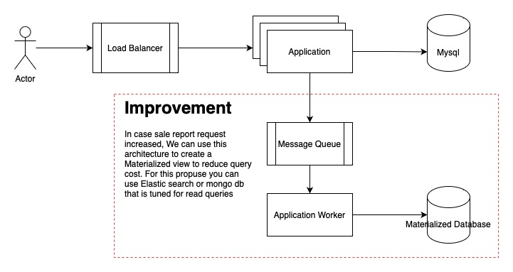
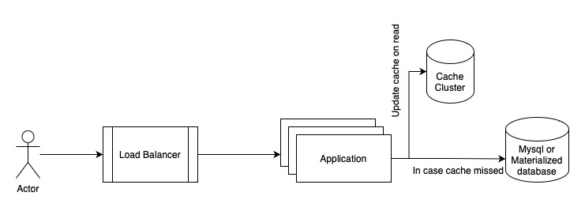

# Anymind interview test
Hi, This readme file contain the information that I want to share with you about the task.
I described each section base on task highlight that was shared with me.

## Endpoints
* http://localhost:8080/playground (GraphQL Playground)
* http://localhost:8080/graphql (GraphQl generic endpoint)

### Make Payment Mutation example:
```
mutation {
  makePayment(paymentRequest: { 
    customerId: 12324,
    paymentMethod: "VISA",
    price: 180.00,
    priceModifier: 0.95,
    dateTime: "2022-09-01T00:00:00Z",
    additionalItems: "{\"last4CardNumber\":\"1234\", \"courierService\":\"YAMATO\"}"
  }) {
    finalPrice,
    points
  }
}

```
Consider `additionalItems` field. It is a String type that is holding an json string. Because graphql schema implementation 
is not support Json as Scalar type you should put your json string here.

### Check payment method Query Example:
```
query {
  paymentMethod(name: "VISA") {
    name,
    minPriceModifier,
    maxPriceModifier,
    pointModifier
  }
}
```

### Sales Report Query example:
```
query  {
  hourlySaleReport(input: {
    startDateTime: "2022-12-11T00:00:00Z",
    endDateTime: "2022-12-15T00:00:00Z"
  }) {
    dateTime,
    points,
    sales
  }
}
```


## Architecture
Application implementation is stateless. State of application is holding in database. I have chosen Mysql as database
because it is relational, easy to use, have a good community and many companies are using it. Why relational database?
Because we are developing POS application. Nature of this application require us to choose a database to handle more writes
and redundant data (That is inevitable in Nosql databases) may cause problem in the future. also Mysql is using **Slave-Master** pattern for scaling.
Also, sharding is a good option in cases that load is going to increase.

Consider `TransactionEntity` for sharding. possible fields for sharding is **user_id**, then we can load balance user request easily
between shards. but it may make administration reports generation more tricky. Another possible field is **date_time** because reports are generating
base on time in most case that will help to keep size of each shard relatively equal.

Anyway, For `MakePayment` command, nature of system should be **CP** in the **CAP Theorem** but base on business logic you
may choose **AP** for report requests. I will describe it in **read scenario** section.
Actually wee need keep **P** from the **CAP theorem** for scaling and load balancing between many servers. that's why we should
choose between **Consistency** and **Availability** between each business scenario. (Real life is hard :) )

For the Web API interface, I have chosen `Graphql` because of its advantages and also the auto-documentation that comes with it.

Authorization implementation is skipped due to time limitation, but you can use authorization token and JWT. check the 
`test.anymind.pos.app.AppGraphqlContextFactory` implementation. You can extract user id and use it in the application.

Application itself is brake down into two section. `app` and `domain`. All business logic should encapsulate in `domain` package.
This architecture is suggested by Clean Architecture book to separate business logic concerns from technology and framework.
But you can see I am using spring service annotate and JPA annotates in domain. Because these items do not cause domain logic couple with
Framework limitation in my opinion it is ok. Because these annotation do not force us to implement any code for framework ord data source.

`app` package is holding application and framework codes. This code should not affect business logic. It means we should be able to change
framework and related technologies any time we need without problem about the business logic.

Also, if we forced to implement some infrastructure code like repository implementions (that in this project, JPA is helping us) we should put them into `infrastructure` package.

### Patterns that is used
* Factory
* Repository
* Clean Architecture principles
* Dependency Inversion
* Dependency Injection by spring framework

### Scale with newer payment methods
Because new payment methods are few (at most maybe 20), You can easily create a class for this payment method and
extend it from `test.anymind.pos.domain.lib.payment.method.APaymentMethod` and implement abstract methods.
Two function is defined in this class, `calculateFinalPrice` to calculate final price and `calculateFinalPoints` to calculate
points. In cases that calculation for `finalPrice` or `points` are different from the base implementation you can overwrite each of them
and implement your own code. But why i decided to separate these functions instead of implementing one method? because of Single Responsibility principle
in OOP. Also, you can add `suspend` keyword and using coroutine if implementation is costly. I did not implement this scenario because
preventing over engineering but code style will support it.
Payment method use factory pattern to build each one is required by name. So you can pass the user input to factory class to 
get suitable `PaymentMethod` implementation.

Also, `addAdditionalData` function is using to modify additional items that provided by user and validate it. Then another method
is using to get the `Json string` for future usages.

### Write scenario


In this application write scenario is straightforward. Because we have Chosen **CP** from **CAP**, On user request
for make payment request we will save data in a atomic mode into database.

But we can improve our design by adding message queue and background workers to create materialized view for future usage in read scenario.
I didn't implement this architecture due to prevent over engineering.


### Read scenario


Read model is strait forward too. In repository, we can generate a simple sql query to retrieve data from mysql. to reduce
 database load, we can also cache the result for specific ttl on our cache cluster. This will help us to prevent repeating query to database for frequent 
sale report request. To make cache more consistent, we can remove cache when a payment for request that is filtering recent sales.

> I didn't implement cache scenario in the repository but it should be simple.


### Error handling
Due to using `GraphQl` as API gateway technology, an Error response is well-defined by GraphQl standard.
I stick to it. also, because GraphQl is using `Schema` to validate user input, in most case, user inputs are typesafe. for logical
error handling i am using `check` method in kotlin and the message will define in each case.
Because I am developing web API, I believe we can omit translation. It is client side concern in most case.

## Unit Testing
I am using junit as it expected :). Some dependencies are added to support Junit integration with spring framework. So for repositories
I can use H2 database for test propose. Also, I limit testing to UnitTesting. Integration testing is an advanced topic and require more detail
about the business logic and etc. So there is no test for GraphQl testing that I believe it is point less in this project since we are defining schema as interface
between our clients and the server.

Due to time limitation I have implemented some `PaymentMethod` test for vary implementations and the `MakePaymentUC` that is the only command logic.
There is no need to write test for all scenario because it is not possible to find them correctly, and it is time-wasting. Instead we can implement tests
for known and possible scenarios that we are aware about them and let the time to help us cover more complicated cases when we find them.
But it is necessary to keep test sync with code.

> I believe best pattern to implement tests is TDD. But because this project is my first spring project with Kotlin, I explored it first
and then i wrote the tests.

## Deploying on production
I have prepared 3 way to run application in your server:

### Run Docker Image from docker hub
https://hub.docker.com/repository/docker/aminkt/anymind-kotlin-pos-app

### Download .jar file from GitHub repository

### Docker Compose file

## Interview Objective
* You have to use Git [✓]
* Your code has to be clear [✓]
* You know good coding practices and patterns [✓]
* Your API can handle incorrect data [✓]
* Your architecture is extendable/testable [✓]
* Your system can be executed easily [✓]
* You can consider multi-thread, many servers [✓]
* Your system should be tested [✓]
* Your system should be able to scale with newer payment methods [✓]

Please let me know if you think I have an issue with my task. I will be thankful to learn from you.
Please help me to improve my skills with sharing your opinion.